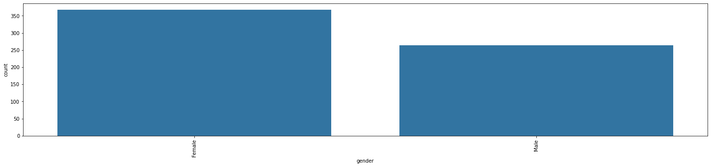
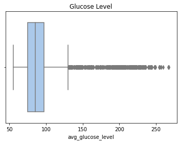

# Stroke Prediction
It's a kaggle competition for predicting Stroke. The Data was generated from a deep learning model trained on the Stroke Prediction Dataset. Using only the generated data, I have reached a score of 0.89557 while the first was 0.9.

## Data Explanatory steps
- Count of Values in Categorical Columns.
- Check Outliers in Numerical Columns.
- Check the relation between categorical column and people suffer from stroke.

## Data Cleaning & Preprocessing
- Remove rows with irrelevant values in both gender and work_type columns.
- Label Encoding to Categorical Data.
- Min-Max Normalization.

## Data Visualiztion
- Relation between Gender and having a stroke.

- Boxplot that shows Outliers in Glucose level column

## ML Model
LightGBM, SGD and Logistic regression are used to obtain the highest score by taking the mean of the three models.

## Competition & Data Link
[Stroke Prediction](https://www.kaggle.com/competitions/playground-series-s3e2/overview)
